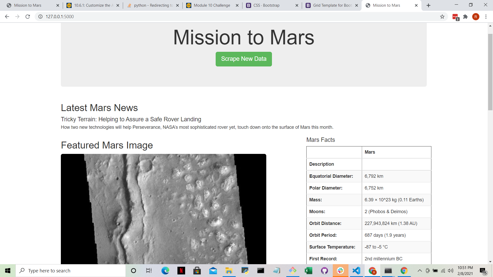

# Mission-to-Mars

## Overview

 Using BeautifulSoup and Splinter we scrape full-resolution images of Mars’s hemispheres and the titles of those images, store the scraped data on a Mongo database, use a web application to display the data, and alter the design of the web app to accommodate these images.

- Scrape Full-Resolution Mars Hemisphere Images and Titles
- Update the Web App with Mars Hemisphere Images and Titles
- Add Bootstrap 3 Components (mobile optimized, button styled, rounded picture corners)

## Resources

Flask, Python, Beautiful Soup, Splinter, MongoDB, Bootstrap 3

